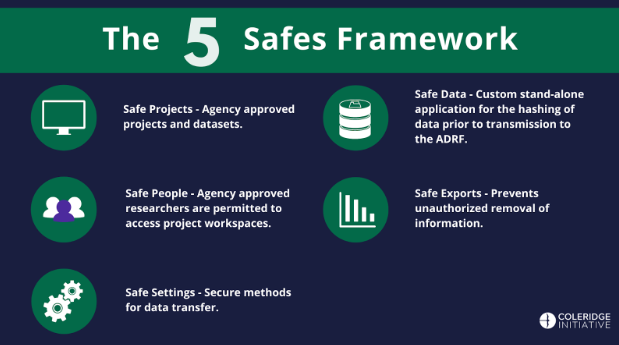

# 1 Introduction

Welcome to the [Coleridge Initiative’s](https://coleridgeinitiative.org/) Administrative Data Research Facility, or "**ADRF**" user guide. This is a living document intended to show new ADRF users how to use the platform for common tasks.

If you have any questions, please reach out to us at [support@coleridgeinitiative.org](mailto:support@coleridgeinitiative.org) 

## Topics
- [About the Coleridge Initiative](#about-the-coleridge-initiative)
- [About the Administrative Data Research Facility](#about-the-administrative-data-research-facility)
- [The Five Safes Security Framework](#the-five-safes-security-framework)

## About the Coleridge Initiative
The Coleridge Initiative’s mission is to improve the access, usability, and impact of data for public policy by fostering collaboration between government agencies, researchers, and other stakeholders. It aims to create a data ecosystem where government data can be more effectively used to inform evidence-based decision-making, policy development, and research.

## About the Administrative Data Research Facility
The Administrative Data Research Facility (ADRF) is a platform provided by the Coleridge Initiative that enables researchers to access and analyze administrative data from government agencies securely and efficiently. It offers a secure computing environment where researchers can work with sensitive data while ensuring privacy and confidentiality. The ADRF provides tools and infrastructure for data integration, analysis, and visualization, allowing researchers to conduct rigorous and reproducible studies using large-scale administrative datasets. By facilitating access to valuable data resources and promoting collaboration between researchers, government agencies, and other stakeholders, the ADRF supports evidence-based policymaking and advances research in fields such as public health, education, labor economics, and social policy.

## The Five Safes Security Framework
The ADRF follows the Five Safes Framework, a data management framework commonly used in government agencies, to ensure the safe use of sensitive and confidential data assets. It considers five dimensions in making data-related safety and security decisions: Safe Projects, Safe People, Safe Settings, Safe Data, and Safe Exports.

- **Safe Projects** - The ADRF contains only agency approved projects that have been proposed and agreed upon by project and dataset stewards. Only approved projects are housed within ADRF, only approved individuals are granted access to a given project, and project environments are kept separated from each other. These approved projects require signed agreements and only approved users can access the project workspaces within the platform.
- **Safe People** - Only approved researchers are permitted to access project workspaces and related resources. Each individual with approved access must complete security training, agree to the ADRF terms of use, and sign relevant data use agreements. Individuals must authenticate to gain access to the remote platform and all ADRF activity is monitored. 
- **Safe Settings** - The ADRF is designed to provide secure methods of data transfer for agency micro-data, specifically data that includes Personally Identifiable Information. Only agency identified and authorized personnel are invited to perform data transfers.
- **Safe Data** - Before transmission to ADRF, all data with personally identifiable or other sensitive information is hashed, and an online data stewardship application provides data stewards with information on who is accessing their data, how it is being accessed, what projects employ it, the characteristics of each data asset, and the status of user agreements. 
- **Safe Exports** - Users are prevented from unauthorized removal of any information within the secure environment.

#

[Back to Home](00-cover.md) | [Next: Obtaining ADRF Access ➡️](02-access.md)
