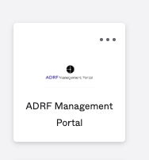
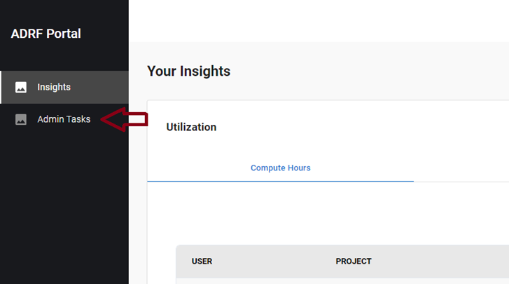
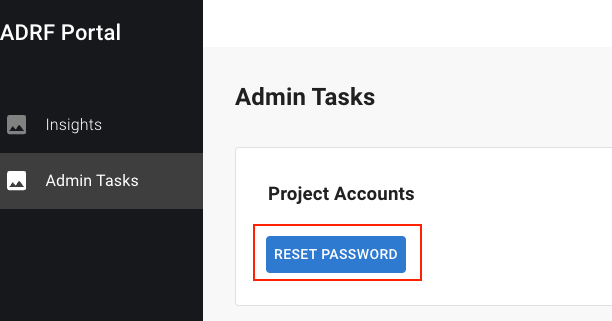

# 13 Frequently Asked Questions (FAQ)

## Topics
- [How do I set up my Multifactor Authentication](#how-do-i-set-up-my-multifactor-authentication)
- [Can I set up more than one form of Multifactor Authentication?](#can-i-set-up-more-than-one-form-of-multifactor-authentication)
- [How can I reset my Okta password?](#how-can-i-reset-my-okta-password)
- [How can I reset my ADRF password?](#how-can-i-reset-my-adrf-password)
- [What if I do not remember my security questions or if I get locked out?](#what-if-i-do-not-remember-my-security-questions-or-if-i-get-locked-out)
- [I can log into the ADRF but my desktop and DS application just show blank pages.](#i-can-log-into-the-adrf-but-my-desktop-and-ds-application-just-show-blank-pages)
- [I saved a file in the C: drive or in the Desktop. When I logged back in, the file is no longer there. Can you restore it?](#i-saved-a-file-in-the-c-drive-or-in-the-desktop.-when-i-logged-back-in,-the-file-is-no-longer-there.-can-you-restore-it)
- [How do I open an ipynb notebook?](#how-do-i-open-an-ipynb-notebook)
- [How can I ingest publicly available data into the ADRF?](#how-can-i-ingest-publicly-available-data-into-the-adrf)
- [Where can I access publicly available data from within the ADRF?](#where-can-i-access-publicly-available-data-from-within-the-adrf)
- [Where is my project or training related data stored?](#where-is-my-project-or-training-related-data-stored)
- [My data is not in a relational format. Where can I find these files?](#my-data-is-not-in-a-relational-format.-where-can-i-find-these-files)
- [What is the difference between the P:, U: and G: drives?](#what-is-the-difference-between-the-p-u-and-g-drives)
- [I need to process a large amount of relational data. What is the destination location?](#i-need-to-process-a-large-amount-of-relational-data.-what-is-the-destination-location)

## How do I set up my Multifactor Authentication
You should be prompted to set up multifactor authentication when you create your account, the options are SMS, voice call, email and the Okta verify application.

## Can I set up more than one form of Multifactor Authentication?
This is recommended. If you lose access to one form of MFA, you would still be able to gain access to your account using an alternative. To do so, please log on to https://adrf.okta.com and select your name on the top right and click settings. Here you can modify or set up your SMS, voice call, email or Okta multifactor authentication.

## How can I reset my Okta password?
You can use the “Need help signing in?” option on the sign on page (https://adrf.okta.com) which will send a link to your email to reset your password. You may have to verify your identify by answering security questions which you set up when creating your account.

## How can I reset my ADRF password?
You can reset your ADRF project password by following these steps:

1. Click on the ADRF Management Portal Okta Tile:

3. Then click on Admin Tasks on the left hand side of the screen:

4. Then click on RESET PASSWORD:

You’ll see a screen where you can choose the project(s) for which you want to update the password.

## What if I do not remember my security questions or if I get locked out?
You would have to reach out to support at support@coleridgeinitiative.org to have your account unlocked and you would have to reset your security questions so that you can recover your account in the future.

## I can log into the ADRF but my desktop and DS application just show blank pages.
Please ensure the connection to ADRF is not being blocked by your organizations VPN and/or firewall (try using a device not connected to your organization’s network) and reach out to [support@coleridgeinitiative.org](mailto:support@coleridgeinitiative.org).

## I saved a file in the C: drive or in the Desktop. When I logged back in, the file is no longer there. Can you restore it?
The ADRF is a temporary workspace environment, files left on the desktop will be removed when you log out of your session, and we cannot restore these files. See section  Best practice is to store files in your user folder on the U: drive

## How do I open an ipynb notebook?
On the desktop you should find an icon for JupyterLab, when you click that, a command prompt and a browser window are opened up, leave the command prompt running. You should be able to open the file by selecting File -> Open From Path  and providing the path to the folder containing the ipynb notebook.

## How can I ingest publicly available data into the ADRF?
Please open a support request by sending an email to support@coleridgeinitiative.org. Include the dataset you wish to have available inside the ADRF and documentation that confirms that the dataset is public.

## Where can I access publicly available data from within the ADRF?
Publicly available data is stored in the schema ds_public_1.

## Where is my project or training related data stored?
All project and training related databases are prefixed with ‘pr_’ (for project) or ‘tr_’ (for training). You may use this space when creating intermediate datasets or as a “working space”. All project members have read and write access to this area (specific to your project).

## My data is not in a relational format. Where can I find these files?
Read-only non-relational data are stored in the G:\ drive on Windows Explorer. Project specific non-relational data and files are stored in project specific folders that are prefixed with ‘pr_’ or ‘tr_’.  The location of these folders are in the P:\ drive on Windows Explorer.

## What is the difference between the P:, U: and G: drives?
Each drive location has a different purpose and access rule:
- P:  Project specific files shared by ALL project members
- U:  User personal space.  Only the user has read/write access to this area.
- G:  Non-relational datasets.  Read-only access to authorized users only.

## I need to process a large amount of relational data. What is the destination location?
The best practice is to process the data where it is currently located.  If the data is in a relational database, perform as much of your processing using Redshift to make the most efficient use of resources (i.e. filtering, sorting, etc). 

#

[⬅️ Previous: Accessing ADRF Dashboards](12-dashboards.md)  | [Back to Home](00-cover.md) |
